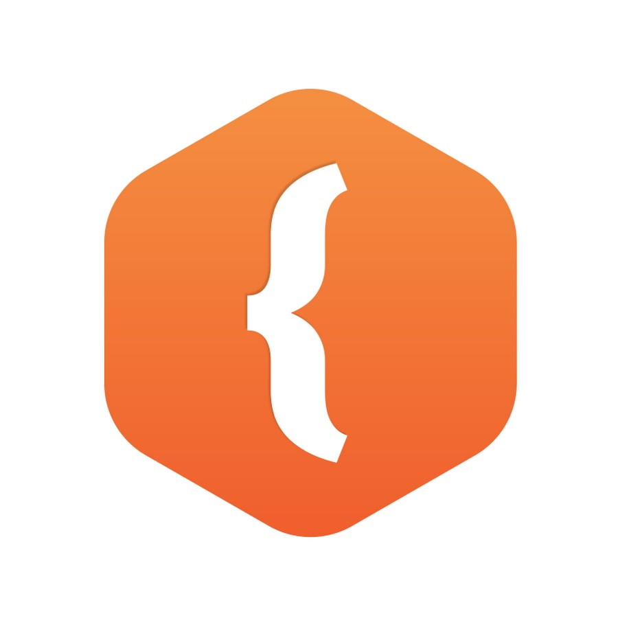

# neobis_1
## Neobis 1 week  
create: 17.10.2023  
author: Meuert Kachkynbaeva  

### Day 1  
* __work with git__
* work with github

~~~
 [HttpPost]
        public async Task<IActionResult> Login(LoginViewModel model) {
            if (ModelState.IsValid) {
                var result =
                    await signInManager.PasswordSignInAsync(model.Email, model.Password, true, false);
                if (result.Succeeded) {
                    var user = userManager.FindByEmailAsync(model.Email).Result;
                    if (!string.IsNullOrEmpty(model.ReturnUrl) && Url.IsLocalUrl(model.ReturnUrl)) {
                        return Redirect(model.ReturnUrl);
                    } else {
                        return RedirectToAction("Index", "Orders");
                    }
                } else {
                    ModelState.AddModelError("", "Неправильный логин и (или) пароль");
                }
            }
            return View(model);
        }
~~~
[Ссылка на репозиторий](https://github.com/teurem/VKR-AutoServise/tree/master)  

